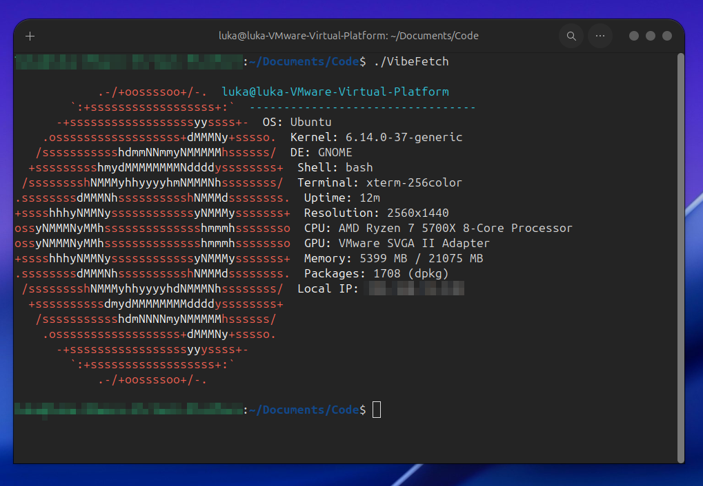
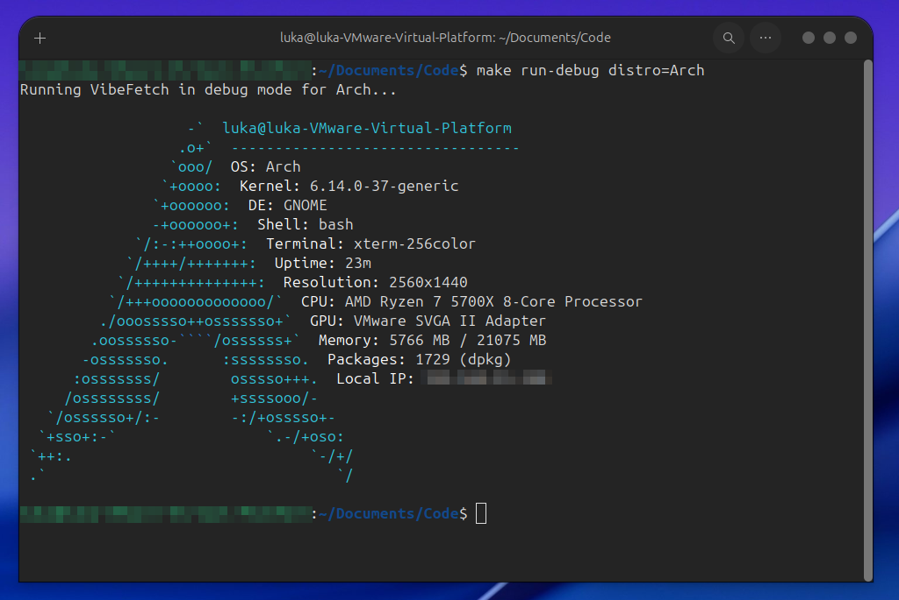
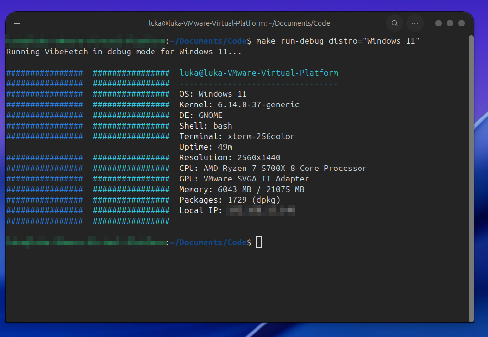
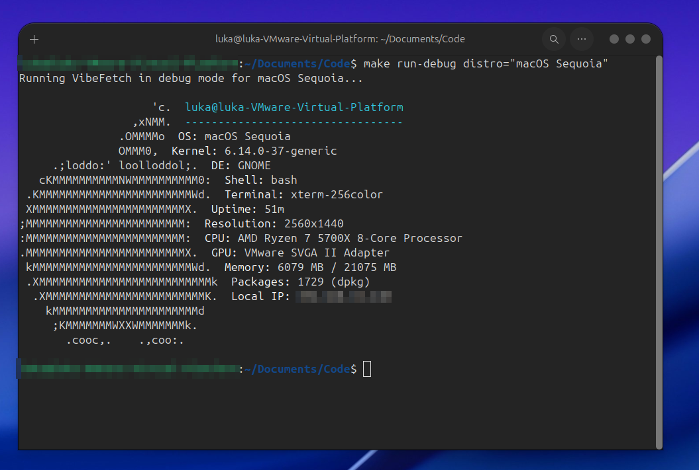

# VibeFetch

<div align="center">






**A vibrant system information tool with personality!**

[](https://opensource.org/licenses/MIT)
[](https://en.cppreference.com/w/cpp/11)
[]()

</div>

---

## ✨ Features

- 🎨 **Beautiful ASCII Art** - Custom designs for 20+ operating systems
- 🌈 **Colorful Output** - ANSI color support with OS-specific themes
- 💻 **Cross-Platform** - Native support for Linux, macOS, and Windows
- ⚡ **Lightning Fast** - Written in C++ for optimal performance
- 🔧 **Highly Configurable** - Customize display options to your liking
- 📊 **Comprehensive Info** - CPU, GPU, Memory, Disk, Network, and more
- 🎯 **Zero Dependencies** - No external libraries required

## 📸 Screenshots

<div align="center">

**Ubuntu Display**
```
./VibeFetch
```


**Arch Linux Display**
```
make run-debug distro=Arch
```


</div>

## 🚀 Quick Start

### Prerequisites

- C++ compiler with C++11 support (GCC, Clang, or MSVC)
- Make (optional, but recommended)
- Git (for cloning)

### Installation

#### Linux & macOS

```bash
# Clone the repository
git clone https://github.com/Luka12-dev/Vibefetch.git
cd Vibefetch

# Build
make all # Make run for build and run

# Run
./VibeFetch

# Install system-wide (optional)
sudo make install
```

#### Windows

```cmd
# Clone the repository
git clone https://github.com/Luka12-dev/Vibefetch.git
cd Vibefetch

# Build with MinGW
g++ -std=c++11 -O2 VibeFetch.cpp -o VibeFetch.exe

# Run
./VibeFetch.exe
```

## 📖 Usage

### Basic Usage

```bash
# Display system information
./VibeFetch

# Display help
./VibeFetch --help

# Show version
./VibeFetch --version
```

### Debug Mode (Test Different OS Displays)

```bash
# Test Ubuntu display
make run-debug distro=Ubuntu

# Test Windows 11 display
make run-debug distro="Windows 11"

# Test Pop!_OS display (note the single quotes)
make run-debug distro='Pop!_OS'

# Test macOS display
make run-debug distro="macOS Sonoma"
```

### Supported Operating Systems

<details>
<summary><b>🐧 Linux Distributions</b></summary>

- Ubuntu
- Debian
- Arch Linux
- Fedora
- Linux Mint
- Kali Linux
- RHEL (Red Hat Enterprise Linux)
- Gentoo
- Pop!_OS
- Zorin OS

</details>

<details>
<summary><b>🪟 Windows Versions</b></summary>

- Windows XP
- Windows Vista
- Windows 7
- Windows 8
- Windows 10
- Windows 11

</details>

<details>
<summary><b>🍎 macOS Versions</b></summary>

- macOS Big Sur (11)
- macOS Monterey (12)
- macOS Ventura (13)
- macOS Sonoma (14)
- macOS Sequoia (15)
- macOS 26 (future-proof)

</details>

## 🛠️ Building from Source

### Using Make (Recommended)

```bash
# Build release version
make

# Build debug version with symbols
make debug

# Clean build artifacts
make clean

# Run tests
make test

# Check syntax
make check-syntax

# Run benchmark
make benchmark
```

### Manual Compilation

#### Linux
```bash
g++ -std=c++11 -O2 -Wall -Wextra VibeFetch.cpp -o VibeFetch
```

#### macOS
```bash
clang++ -std=c++11 -O2 -Wall -Wextra VibeFetch.cpp -o VibeFetch
```

#### Windows (MinGW)
```cmd
g++ -std=c++11 -O2 -Wall -Wextra VibeFetch.cpp -o VibeFetch.exe -lws2_32
```

#### Windows (MSVC)
```cmd
cl /std:c++11 /O2 /EHsc VibeFetch.cpp
```

## ⚙️ Configuration

VibeFetch supports configuration files for customization:

```ini
# ~/.config/vibefetch/config.ini

[Display]
show_ascii=true
show_colors=true
ascii_distro=auto

[Information]
show_os=true
show_kernel=true
show_cpu=true
show_gpu=true
show_memory=true
show_disk=true
show_network=false

[Advanced]
verbose=false
debug=false
export_format=text
```

## 📊 Information Displayed

| Category | Information |
|----------|-------------|
| **System** | OS, Distribution, Kernel Version, Architecture |
| **Hardware** | CPU Model, GPU Model, Motherboard, BIOS |
| **Memory** | Total RAM, Used/Available, Swap Usage |
| **Storage** | Disk Type (HDD/SSD), Capacity, Usage |
| **Network** | Local IP, Gateway, MAC Address, Interface |
| **Software** | Desktop Environment, Window Manager, Shell, Terminal |
| **Performance** | CPU Usage, Memory Usage, Uptime, Temperature |
| **Packages** | Installed Packages Count, Package Manager |

## 🎨 Customization

### Custom ASCII Art

You can add your own ASCII art by modifying the `getASCIIArt()` function:

```cpp
vector<string> getCustomASCII() {
    vector<string> art;
    art.push_back("  Your Custom  ");
    art.push_back("  ASCII Art   ");
    art.push_back("  Goes Here   ");
    return art;
}
```

### Color Schemes

Customize colors by modifying the color constants:

```cpp
const int COLOR_PRIMARY = COLOR_BRIGHT_CYAN;
const int COLOR_SECONDARY = COLOR_BRIGHT_BLUE;
```

## 🔧 Makefile Targets

| Target | Description |
|--------|-------------|
| `make` | Build VibeFetch (default) |
| `make run` | Build and run VibeFetch |
| `make run-debug distro=<OS>` | Test specific OS display |
| `make clean` | Remove build artifacts |
| `make install` | Install to system (requires sudo) |
| `make uninstall` | Remove from system |
| `make test` | Run test suite |
| `make debug` | Build with debug symbols |
| `make benchmark` | Run performance benchmark |
| `make help` | Show all available targets |

## 🤝 Contributing

Contributions are welcome! Here's how you can help:

1. **Fork the repository**
2. **Create a feature branch** (`git checkout -b feature/AmazingFeature`)
3. **Commit your changes** (`git commit -m 'Add some AmazingFeature'`)
4. **Push to the branch** (`git push origin feature/AmazingFeature`)
5. **Open a Pull Request**

### Contribution Guidelines

- Follow existing code style and conventions
- Add comments for complex logic
- Test on multiple platforms if possible
- Update documentation for new features
- Add ASCII art for new OS support

## 🐛 Bug Reports

Found a bug? Please open an issue with:

- Your operating system and version
- Expected behavior vs actual behavior
- Steps to reproduce
- VibeFetch version (`./VibeFetch --version`)
- Screenshots if applicable

## 📝 License

This project is licensed under the MIT License - see the [LICENSE](LICENSE) file for details.

```
MIT License

Copyright (c) 2025 Luka

Permission is hereby granted, free of charge, to any person obtaining a copy
of this software and associated documentation files (the "Software"), to deal
in the Software without restriction, including without limitation the rights
to use, copy, modify, merge, publish, distribute, sublicense, and/or sell
copies of the Software, and to permit persons to whom the Software is
furnished to do so, subject to the following conditions:

The above copyright notice and this permission notice shall be included in all
copies or substantial portions of the Software.

THE SOFTWARE IS PROVIDED "AS IS", WITHOUT WARRANTY OF ANY KIND, EXPRESS OR
IMPLIED, INCLUDING BUT NOT LIMITED TO THE WARRANTIES OF MERCHANTABILITY,
FITNESS FOR A PARTICULAR PURPOSE AND NONINFRINGEMENT. IN NO EVENT SHALL THE
AUTHORS OR COPYRIGHT HOLDERS BE LIABLE FOR ANY CLAIM, DAMAGES OR OTHER
LIABILITY, WHETHER IN AN ACTION OF CONTRACT, TORT OR OTHERWISE, ARISING FROM,
OUT OF OR IN CONNECTION WITH THE SOFTWARE OR THE USE OR OTHER DEALINGS IN THE
SOFTWARE.
```

## 🙏 Acknowledgments

VibeFetch is inspired by and pays homage to:

- **[Neofetch](https://github.com/dylanaraps/neofetch)** - The original inspiration
- **[Fastfetch](https://github.com/fastfetch-cli/fastfetch)** - Performance-focused implementation
- **[Screenfetch](https://github.com/KittyKatt/screenFetch)** - Classic screenshot tool

## 📞 Support

- 📖 Architecture: [Architecture](https://github.com/Luka12-dev/Vibefetch/Architecture.md)

## 🗺️ Roadmap

- [ ] Web-based dashboard
- [ ] Remote system monitoring
- [ ] Historical data tracking
- [ ] Custom plugin system
- [ ] Theme marketplace
- [ ] Mobile companion app
- [ ] Cloud integration
- [ ] Machine learning insights

## ⭐ Star History

If you find VibeFetch useful, please consider giving it a star! ⭐

---

<div align="center">

**Made with ❤️ and C++**

*Keep the VIBE alive!* ✨

[Report Bug](https://github.com/Luka12-dev/Vibefetch/issues) · [Request Feature](https://github.com/Luka12-dev/vibefetch/issues) · [Architecture](https://github.com/Luka12-dev/Vibefetch/blob/main/Architecture.md)

</div>
